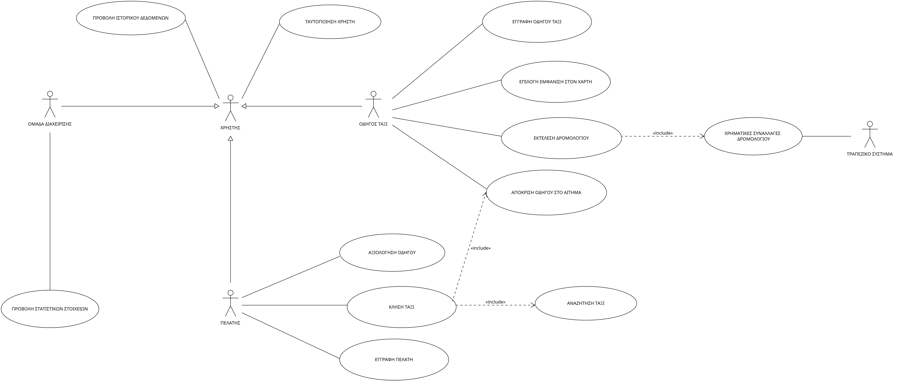

# Εφαρμογή κλήσης ταξί

Η εφαρμογή αναπτύσσεται ως μια υπηρεσία κλήσης ταξί μέσω κινητού τηλεφώνου, η οποία αξιοποιεί τεχνολογίες γεωγραφικού εντοπισμού, ηλεκτρονικών συναλλαγών και συλλογής στατιστικών δεδομένων για τη βελτίωση της συνολικής εμπειρίας μετακίνησης.

## Περιγραφή Απαιτήσεων

Η εφαρμογή διευκολύνει τη διασύνδεση οδηγών ταξί και επιβατών, επιτρέποντας την άμεση επικοινωνία, τη διαχείριση διαδρομών και τις ηλεκτρονικές πληρωμές με τρόπο απλό και ασφαλή. Επιτρέπει στους πελάτες να καλούν ταξί μέσω του κινητού τους τηλεφώνου και στους οδηγούς να προσφέρουν υπηρεσίες μεταφοράς. Συγκεκριμένα, θα δίνει τη δυνατότητα στους πελάτες να αναζητούν και να επιλέγουν ταξί που βρίσκονται κοντά στην τοποθεσία τους, βάση μιας εφαρμογής γεωγραφικής αναζήτησης από το κινητό τους τηλέφωνο. Αντίστοιχα, οι οδηγοί μπορούν να προσφερθούν για μεταφορές, να παρακολουθούν και να διαχειρίζονται την κατάσταση των ταξιδιών τους καθώς και την πληρωμή που τους αναλογεί. Οι βασικές απαιτήσεις του συστήματος είναι:

### 1. Σύνδεση χρήστη

- Κάθε χρήστης (οδηγός ή πελάτης) δημιουργεί έναν λογαριασμό με την καταχώρηση των προσωπικών του στοιχείων.
  - **Για τον οδηγό:** Εισάγονται δεδομένα για το όχημα (π.χ., μάρκα, μοντέλο, αριθμός κυκλοφορίας) και η πιστωτική κάρτα για πληρωμές.
  - **Για τον πελάτη:** Εισάγονται προσωπικά στοιχεία και η πιστωτική του κάρτα για πληρωμή.
- Αν είναι ήδη εγγεγραμένος κάνει ταυτοποίηση στοιχείων.

### 2. Λειτουργία κλήσης ταξί

- Οι πελάτες ανοίγουν την εφαρμογή και εισάγουν την τοποθεσία τους είτε χειροκίνητα είτε μέσω GPS.
- Στη συνέχεια, κάνοντας ο πελάτης αναζήτηση, η εφαρμογή παρέχει μια λίστα με τα διαθέσιμα ταξί στην περιοχή του πελάτη.
- Ο πελάτης επιλέγει το ταξί που επιθυμεί, και ο οδηγός ειδοποιείται άμεσα.

### 3. Εκτέλεση Δρομολογίου

- Ο οδηγός δέχεται το αίτημα και κινείται προς τη θέση του πελάτη. 
- Το GPS του συστήματος ενημερώνει τον πελάτη για την την τοποθεσία του οδηγού καθώς και για την εκτιμώμενη ώρα άφιξης.
- Όταν ο πελάτης επιβιβαστεί, ο οδηγός επιβεβαιώνει την επιβίβαση και ξεκινάει το δρομολόγιο.
- Κατά την ολοκλήρωση της διαδρομής, ο οδηγός επιβεβαιώνει την αποβίβαση και καταγράφει το κόμιστρο. Η τιμή καθορίζεται από την απόσταση και τη διάρκεια της διαδρομής.

### 4. Πληρωμή και Αξιολόγηση

- Το σύστημα προχωρά στην ηλεκτρονική χρέωση του πελάτη και πληρωμή του οδηγού μέσω τραπεζικού συτήματος.
- Αφού παρακρατηθεί μία σταθερή προμήθεια, που αποτελεί έσοδο για την ομάδα διαχείρισης, πιστώνεται ο οδηγός και ειδοποιείται ο πελάτης με τα στοιχεία της χρέωσης.
- Όλες οι συναλλαγές γίνονται μέσω τραπεζικού συστήματος.
- Ο πελάτης έχει τότε τη δυνατότητα αξιολόγησης, ενισχύοντας έτσι την ποιότητα της υπηρεσίας μέσω ανατροφοδότησης.

### 5. Στατιστικά Στοιχεία και Ανάλυση Απόδοσης

- Για συγκεκριμένο χρονικό διάστημα, η ομάδα διαχείρισης συγκεντρώνει και παράγει στατιστικά στοιχεία, όπως πλήθος διαδρομών, πληρωμές και αξιολογήσεις.
- Αυτά τα δεδομένα αναλύονται σταδιακά για να βελτιωθεί η ποιότητα των υπηρεσιών αλλά και για να προσφέρονται στο χρήστη στατιστικά σχετικά με τις προτιμήσεις του και την απόδοση της υπηρεσίας.

## Οι actors του συστήματος

- **Πελάτης:** πραγματοποιεί εγγραφή, αναζήτηση, επιλογή ταξί και αξιολόγηση οδηγού.
- **Οδηγός Ταξί:** πραγματοποιεί εγγραφή, δηλώνει διαθεσιμότητα, διαχειρίζεται διαδρομές και εισάγει το κόμιστρο.
- **Τραπεζικό Σύστημα:** διεκπεραιώνει τις ηλεκτρονικές συναλλαγές μεταξύ πελάτη και οδηγού, εφαρμογής και οδηγού (σταθερή προμήθεια).
- **Ομάδα διαχείρισης:** είναι υπεύθυνη για την παραγωγή και την προβολή στατιστικών στοιχείων, αντιμετώπιση περιστατικών σφαλμάτων.

## Use Case Diagram

## Απαιτήσεις λογισμικού
### [Περιγραφή απαιτήσεων λογισμικού](docs/markdown/uml/requirements/software_requirements.md)

## Μη Λειτουργικές Απαιτήσεις
### [Μη Λειτουργικές Απαιτήσεις](docs/markdown/uml/requirements/non_functional_requirements.md)

## Μοντελοποίηση Πεδίου
### [Περιγραφή Μοντέλου Πεδίου](docs/markdown/uml/requirements/domain_model.md)

## Coverage Report 1
### [Coverage Report 1](docs/tests/coverage_report1.png)

## Υλοποίηση Εφαρμογής
### [AndroidApp](docs/markdown/uml/requirements/android_app.md)

## Coverage Report 2
### [Coverage Report 2](docs/tests/CoverageReport2.png)
