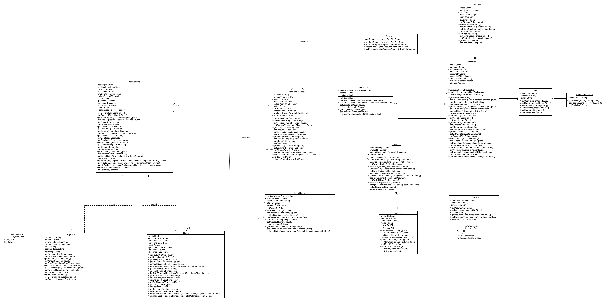
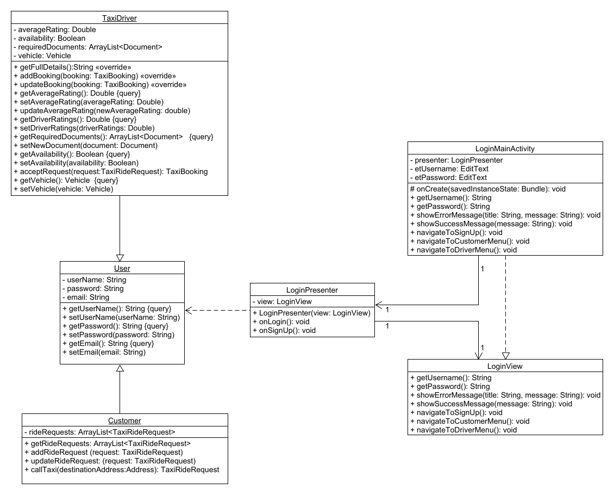
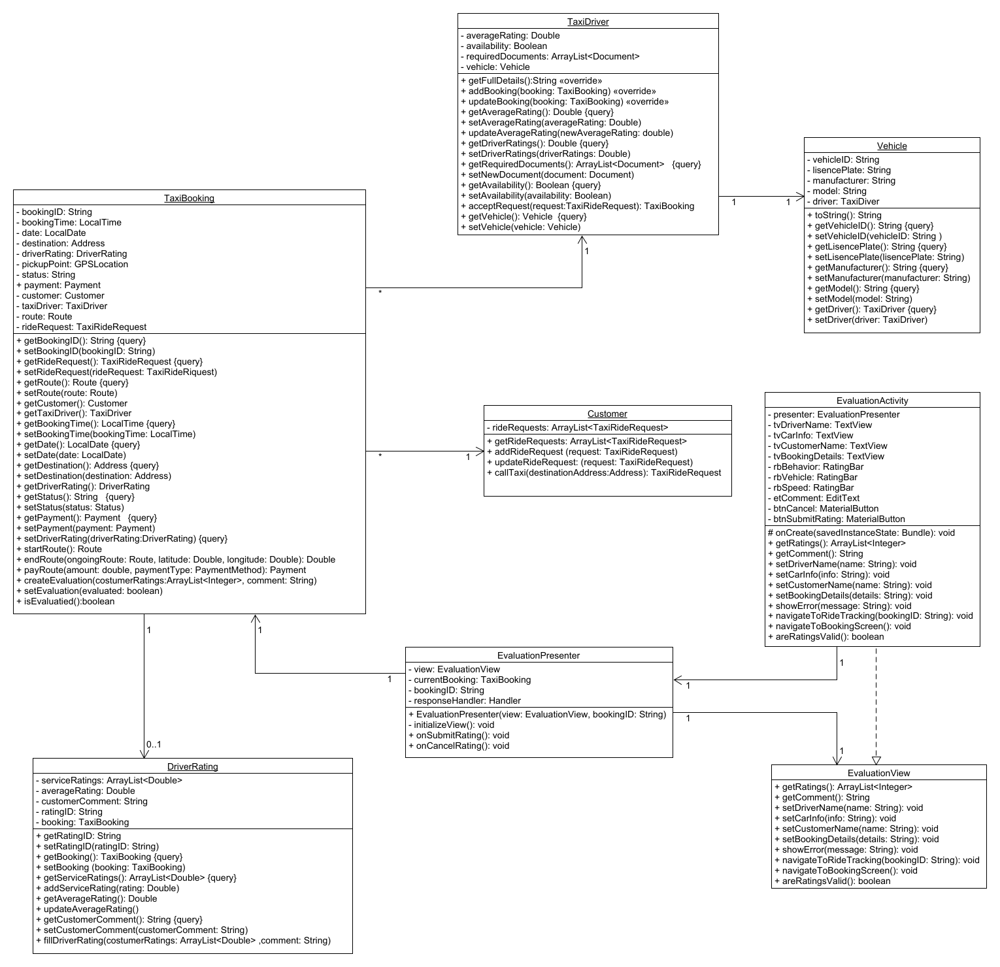
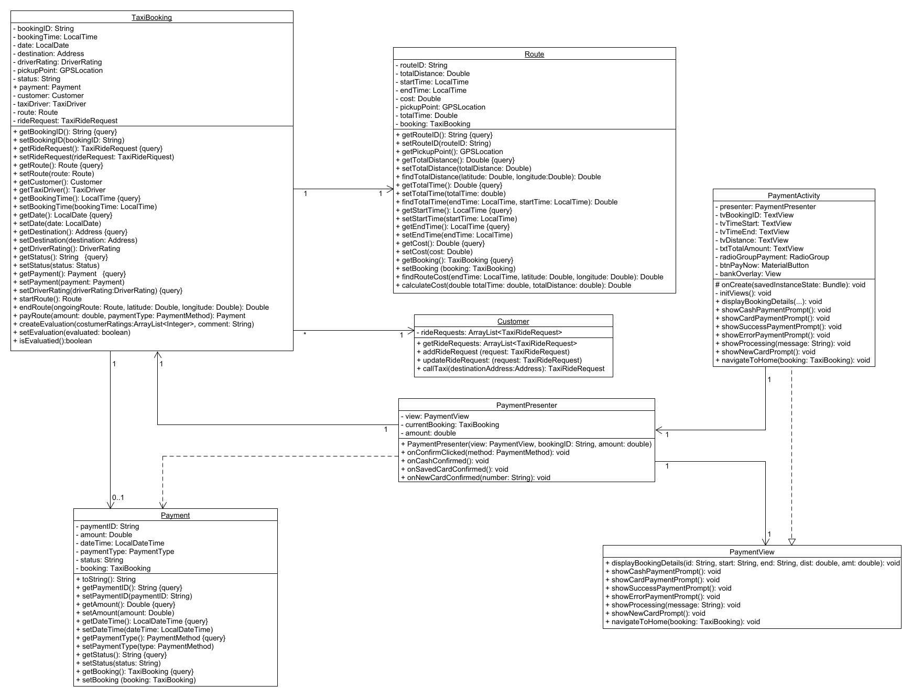
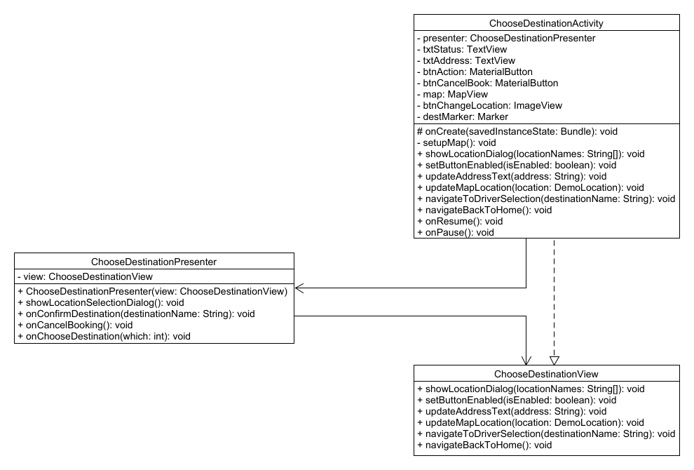
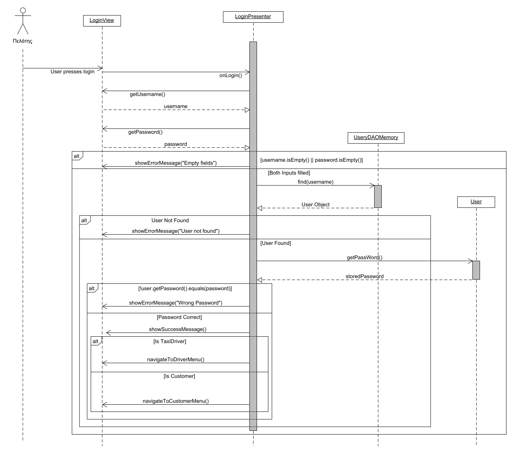
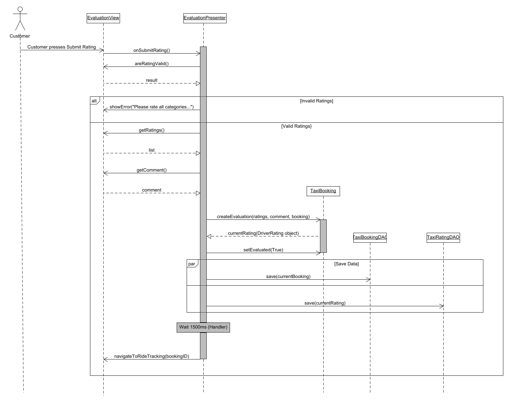
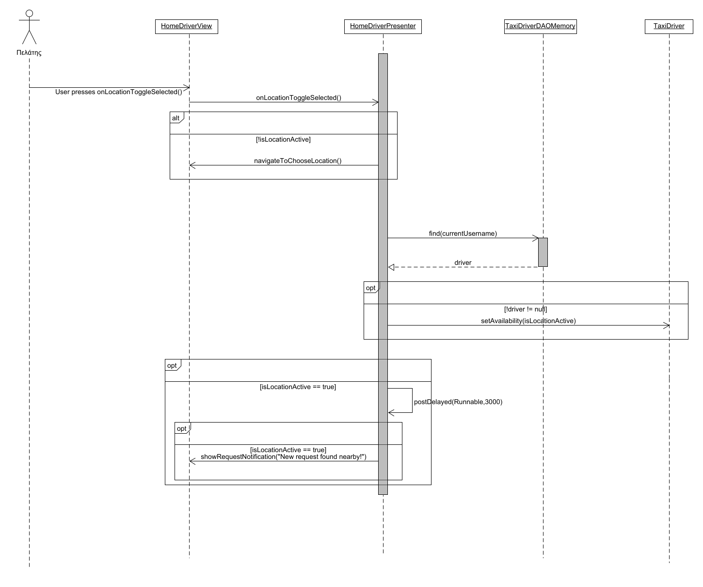

# Υλοποίηση Εφαρμογής 

## Στατική όψη Λογικής Πεδίου

### Login: Class Diagram

### Evaluation: Class Diagram

### Payment: Class Diagram

### Choose Destination: Class Diagram

## Δυναμική όψη Λογικής Πεδίου

### Login: Sequence Diagram

### Evaluation: Sequence Diagram

### Driver Select Location: Sequence Diagram

#### [Επιστροφή στο README](../../../../README.md)