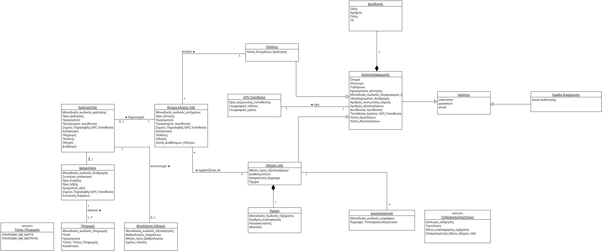
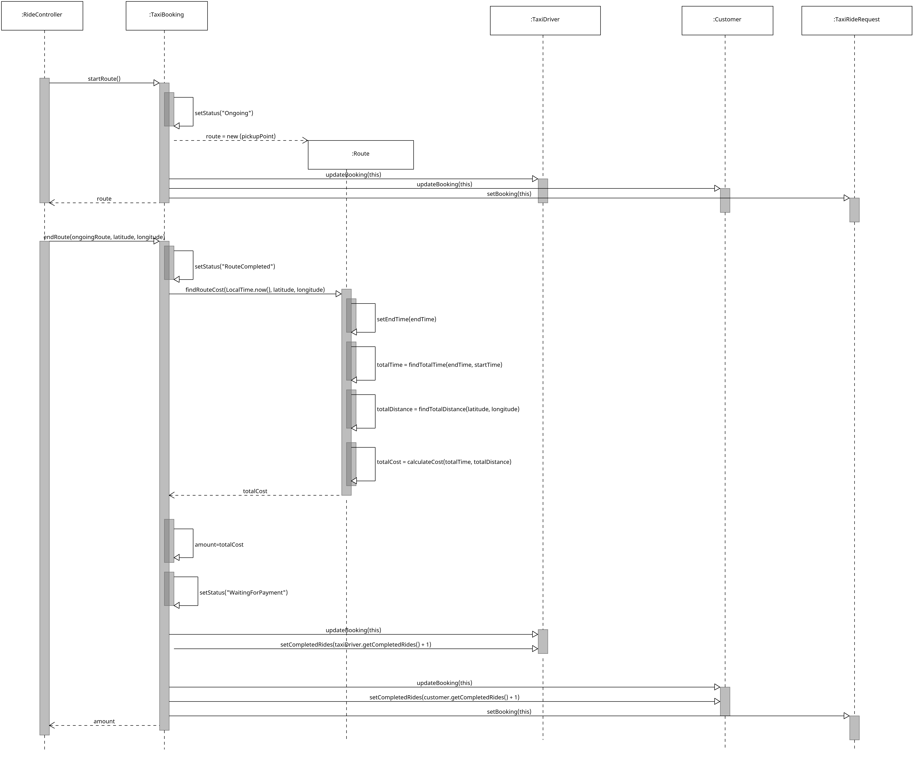
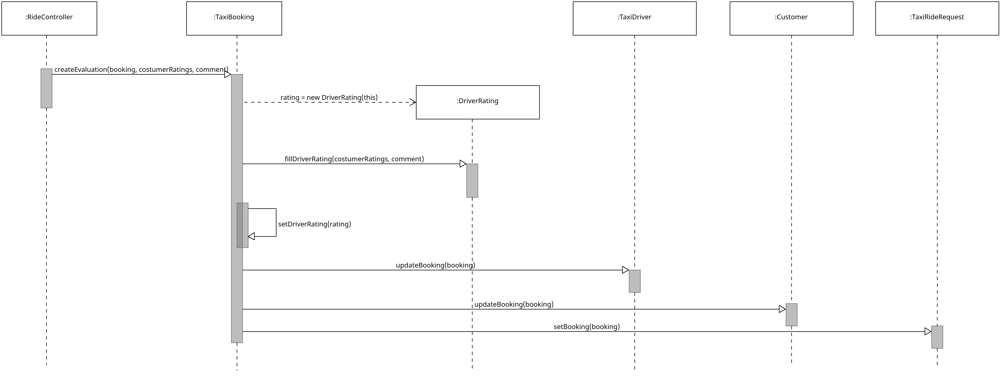

# Μοντελοποίηση Πεδίου

## Επισκόπηση Domain Model

## Στατική όψη Λογικής Πεδίου

## Δυναμική όψη Λογικής Πεδίου

### UC5: Request Taxi - Sequence Diagram

### UC6: Ride Excecution - Sequence Diagram

### UC8: Driver Evaluation - Sequence Diagram

#### [Επιστροφή στο README](../../../../README.md)