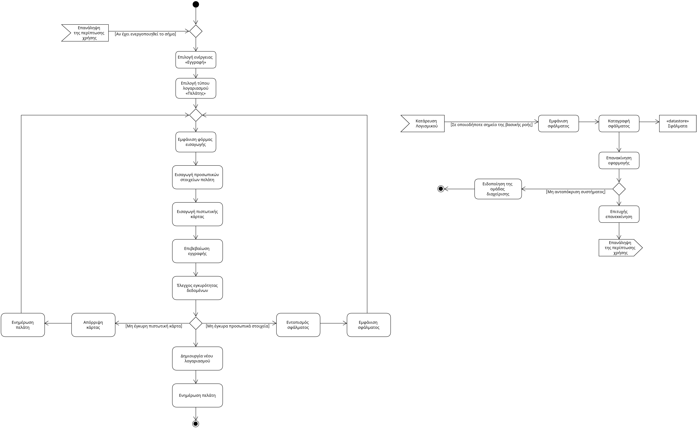

# Use Case 3 - Εγγραφή Πελάτη

- **Πρωτεύων Actor:** Πελάτης   

 ### Ενδιαφερόμενοι: 

- **Πελάτης:** Θέλει να δημιουργήσει έναν νέο λογαριασμό για να πραγματοποιεί μετακινήσεις.
- **Τραπεζικό Σύστημα:** Ελέγχει και επικυρώνει τα στοιχεία πληρωμής του πελάτη.

### Προϋποθέσεις: 

- Ο πελάτης δεν πρέπει να διαθέτει ήδη λογαριασμό στην εφαρμογή.
- Το κινητό του πελάτη πρέπει να είναι συνδεδεμένο στο διαδίκτυο.
  
# Βασική Ροή

- **1:** Ο πελάτης επιλέγει «Εγγραφή» από την εφαρμογή.
- **2:** Ο πελάτης επιλέγει τον τύπο λογαριασμού «Πελάτης».
- **3:** Το σύστημα εμφανίζει φόρμα εισαγωγής στοιχείων.
- **4:** Ο πελάτης εισάγει τα προσωπικά στοιχεία του.
- **5:** Ο πελάτης εισάγει στοιχεία πιστωτικής κάρτας για μελλοντικές πληρωμές.
- **6:** Ο πελάτης επιβεβαιώνει την εγγραφή.
- **7:** Το σύστημα ελέγχει την εγκυρότητα των δεδομένων.
- **8:** Το σύστημα δημιουργεί νέο λογαριασμό.
- **9:** Το σύστημα ενημερώνει τον πελάτη ότι η εγγραφή του ολοκληρώθηκε επιτυχώς.

## Εναλλακτικές ροές:

_*Σε οποιοδήποτε σημείο το λογισμικό καταρρέει._
1. Η εφαρμογή εμφανίζει μήνυμα σφάλματος.
2. Το σύστημα καταγράφει το περιστατικό σφάλματος.
3. Ο πελάτης καλείται να επανεκκινήσει την εφαρμογή.
    1. Το σύστημα δεν ανταποκρίνεται.
        1. Ειδοποιείται άμεσα η ομάδα διαχείρισης της εφαρμογής.
4. Γίνεται επιτυχής επανεκκίνιση. 
5. Η περίπτωση χρήσης γυρνάει στο βήμα 1.

- **7α.** Τα προσωπικά στοιχεία που έχει βαλει ο πελάτης είναι λανθασμένα.
   - **1.** Το σύστημα εντοπίζει σφάλμα.
   - **2.** Το σύστημα εμφανίζει μήνυμα λάθους.
   - **3.** Η περίπτωση χρήσης γυρνάει στο βήμα 3 της βασικής ροής.

- **7β.** Απόρριψη πιστωτικής κάρτας.
   - **1.** Το τραπεζικό σύστημα αποτυγχάνει να εγκρίνει την κάρτα.
   - **2.** Το σύστημα ενημερώνει τον πελάτη.
   - **3.** Η περίπτωση χρήσης γυρνάει στο βήμα 3 της βασικής ροής.

## Activity Diagram 

#### [Επιστροφή στις Προδιαγραφές Λογισμικού](software_requirements.md)