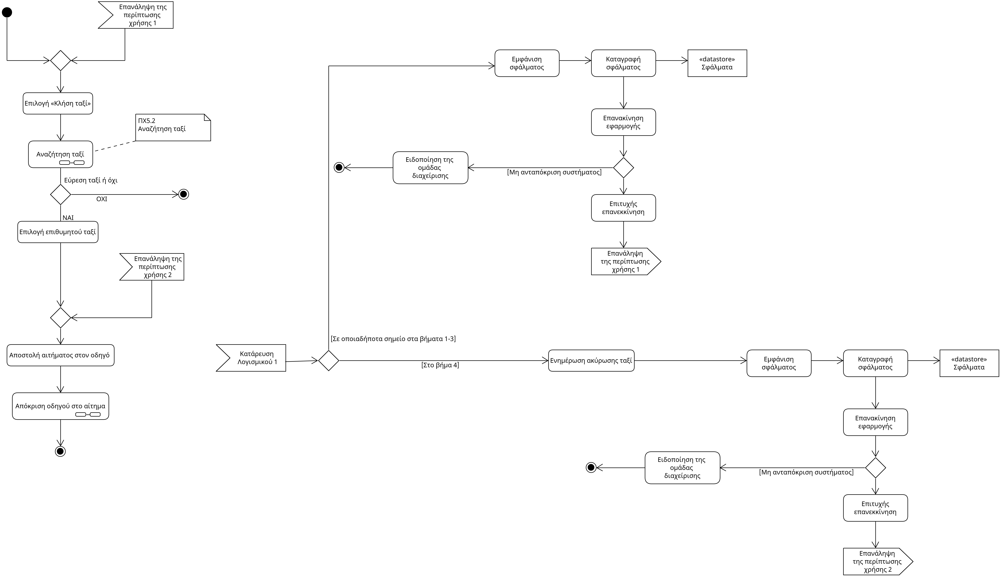

# Use Case 5 - Κλήση ταξί

- **Πρωτεύον Actor:** Πελάτης

### Ενδιαφερόμενοι:

- **Πελάτης:** Θέλει να καλέσει ταξί για να μετακινηθεί.
- **Οδηγός:** Λαμβάνει αιτήματα.

### Προϋποθέσεις:

- Ο πελάτης είναι εγγεγραμμένος και συνδεδεμένος.

# Βασική Ροή:

- **1:** Ο πελάτης επιλέγει την ενέργεια «Κλήση Ταξί».
- **2:** Το σύστημα εκτελεί το Use Case [«Αναζήτηση Ταξί»](uc5.1-search_a_taxi.md).
- **3:** Ο πελάτης επιλέγει το ταξί που επιθυμεί να τον μετακινήσει.
- **4:** Το σύστημα αποστέλλει αίτημα στον οδηγό.
- **5:** Το σύστημα εκτελεί το Use Case [«Απόκριση οδηγού στο αίτημα»](uc5.2-driver_response_to_request.md)
 

# Εναλλακτικές Ροές:
_1-3a. Το λογισμικό καταρρέει στα βήματα 1-3._
1. Η εφαρμογή εμφανίζει μήνυμα σφάλματος.
2. Το σύστημα καταγράφει το περιστατικό σφάλματος.
3. Ο πελάτης καλείται να επανεκκινήσει την εφαρμογή.
    1. Το σύστημα δεν ανταποκρίνεται.
        1. Ειδοποιείται άμεσα η ομάδα διαχείρισης της εφαρμογής.
4. Γίνεται επιτυχής επανεκκίνιση. 
5. Η περίπτωση χρήσης ξεκινάει από το βήμα 1.

_4a.Το λογισμικό καταρρέει στο βήμα 4._
1. Ο οδηγός ενημερώνεται ότι το αίτημα ακυρώθηκε.
2. Η εφαρμογή εμφανίζει μήνυμα σφάλματος.
3. Το σύστημα καταγράφει το περιστατικό σφάλματος.
4. Ο πελάτης καλείται να επανεκκινήσει την εφαρμογή.
    1. Το σύστημα δεν ανταποκρίνεται.
        1. Ειδοποιείται άμεσα η ομάδα διαχείρισης της εφαρμογής.
5. Γίνεται επιτυχής επανεκκίνιση. 
6. Η περίπτωση χρήσης ξεκινάει από το βήμα 1.

## Activity diagram

#### [Επιστροφή στις Προδιαγραφές Λογισμικού](software_requirements.md)