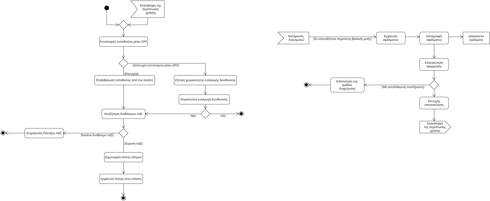
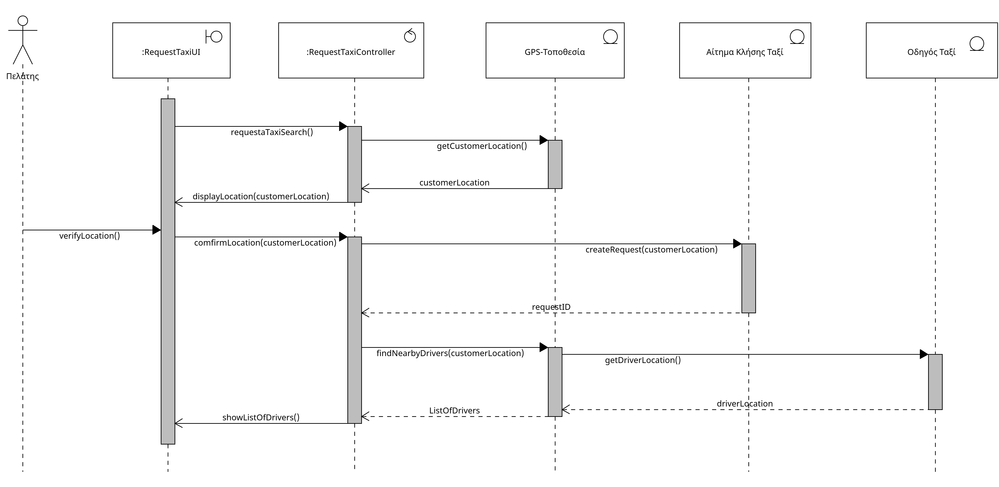

# Use Case 5.1 - Αναζήτηση ταξί

- **Πρωτεύον Actor:** Πελάτης
  
### Ενδιαφερόμενοι:

- **Πελάτης:** Θέλει να εντοπίσει διαθέσιμα ταξί κοντά του.
- **Οδηγός Ταξί:** Εμφανίζεται στον χάρτη ως διαθέσιμος για νέες κλήσεις.

### Προϋποθέσεις:

- Ο πελάτης έχει συνδεθεί στην εφαρμογή.
- Ο πελάτης πρέπει να έχει ανοιχτή την τοποθεσία του κινητού του ώστε να εντοπιστεί μέσω του GPS.

# Βασική Ροή:

- **1:** Το σύστημα βρίσκει την τοποθεσία του πελάτη μέσω GPS.
- **2:** Ο πελάτης επιβεβαιώνει την τοποθεσία.
- **3:** Το σύστημα αναζητά διαθέσιμα ταξί κοντά στην περιοχή.
- **4:** Το σύστημα δημιουργεί μία λίστα των διαθέσιμων οδηγών.
- **5:** Το σύστημα εμφανίζει την λίστα στον πελάτη μαζί με βασικές πληροφορίες για τους οδηγούς.

# Εναλλακτικές Ροές:

_*Σε οποιοδήποτε σημείο το λογισμικό καταρρέει._
1. Η εφαρμογή εμφανίζει μήνυμα σφάλματος.
2. Το σύστημα καταγράφει το περιστατικό σφάλματος.
3. Ο πελάτης καλείται να επανεκκινήσει την εφαρμογή.
    1. Το σύστημα δεν ανταποκρίνεται.
        1. Ειδοποιείται άμεσα η ομάδα διαχείρισης της εφαρμογής.
4. Γίνεται επιτυχής επανεκκίνιση. 
5. Η περίπτωση χρήσης ξαναγυρνάει στο βήμα 1.

- **1α.** Το GPS αποτυγχάνει να βρει την τοποθεσία του χρήστη.
    - **1.** Το σύστημα ζητάει από τον χρήστη να βάλει χειροκίνητα την τοποθεσία του.
    - **2.** Ο πελάτης εισάγει την διεύθυνση του.
    - **3.** Η περίπτωση χρήσης συνεχίζει στο βήμα 3 της βασικής ροής.

- **1α.2α.** Ο πελάτης δεν βάζει διεύθυνση. 
        - Η περίπτωση χρήσης ολοκληρώνεται.

- **3α.** Δεν υπάρχουν διαθέσιμα ταξί.
   - **1.** Το σύστημα ενημερώνει τον πελάτη ότι δεν υπάρχουν διαθέσιμα ταξί.
   - **2.** Η περίπτωση χρήσης τερματίζεται.

## Activity Diagram

## Sequence Diagram

#### [Επιστροφή στις Προδιαγραφές Λογισμικού](software_requirements.md)