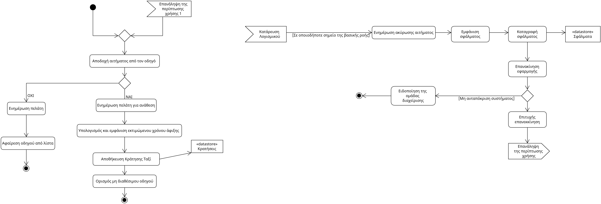

# Use Case 5.2 - Απόκριση οδηγού στο αίτημα

- **Πρωτεύον Actor:** Οδηγός ταξί

### Ενδιαφερόμενοι:

- **Οδηγός ταξί:** Αποδέχεται ή απορρίπτει το αίτημα κλήσης ταξί
- **Πελάτης:** Περιμένει την απόκριση του οδηγού ταξί

### Προϋποθέσεις:
- Ο οδηγός ταξί πρέπει να έχει στείλει τα απαραίτητα δικαιολογητικά

# Βασική Ροή:
- **1:** Ο οδηγός αποδέχεται το αίτημα.
- **2:** Το σύστημα ενημερώνει τον πελάτη ότι ο οδηγός τον έχει αναλάβει.
- **3:** Το σύστημα υπολογίζει και εμφανίζει στον πελάτη τον εκτιμώμενο χρόνο άφιξης.
- **4:** Το σύστημα αποθηκεύει την κράτηση ταξί.
- **5:** Το σύστημα θέτει τον οδηγό μη διαθέσιμο.

# Εναλλακτικές Ροές:
_. Το λογισμικό καταρρέει._
1. Ο πελάτης ενημερώνεται για την ακύρωση του αιτήματος.
1. Η εφαρμογή εμφανίζει μήνυμα σφάλματος.
2. Το σύστημα καταγράφει το περιστατικό σφάλματος.
3. Ο πελάτης καλείται να επανεκκινήσει την εφαρμογή.
    1. Το σύστημα δεν ανταποκρίνεται.
        1. Ειδοποιείται άμεσα η ομάδα διαχείρισης της εφαρμογής.
4. Γίνεται επιτυχής επανεκκίνιση. 
5. Η περίπτωση χρήσης ξεκινάει από το βήμα 1.

_1α._ Ο οδηγός απορίπτει το αίτημα ή δεν απαντάει ποτέ.
 1. Το σύστημα ενημερώνει τον πελάτη.
 2. Το σύστημα αφαιρεί τον οδηγό ταξί από την λίστα των διαθέσιμων οδηγών.
   

## Activity Diagram

#### [Επιστροφή στις Προδιαγραφές Λογισμικού](software_requirements.md)