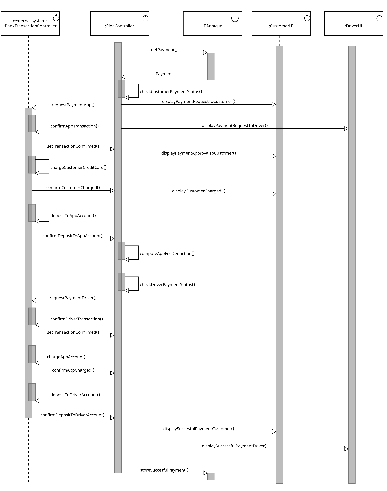

# **Use case 7 - Χρηματικές Συναλλαγές Δρομολογίου**

**Πρωτεύων Actor:**
* Τραπεζικό Σύστημα

**Ενδιαφερόμενοι:**
* Τραπεζικό Σύστημα:  Υπεύθυνο για την ορθή και αποτελεσματική διεξαγωγή των απαραιτήτων χρηματικών συναλλαγών κατα την ολοκλήρωση μίας διαδρομής με ταξί (ανάληψη/κατάθεση).
* Πελάτης:     Ενδιαφέρεται για την ασφαλή πληρωμή του κομίστρου.
* Οδηγός Ταξί:  Επιθυμεί να λάβει το ποσό που του αναλογεί για τις υπηρεσίες του χωρίς καθυστέρηση.

**Προυποθέσεις:**
* Το σύστημα έχει την δυνατότητα να γνωρίζει όλες τις αναλήψεις που έχουν πραγματοποιηθεί.
* Το τραπεζικό σύστημα είναι συγχρονισμένο και διαθέσιμο για εκτέλεση της συναλλαγής.
* Το τραπεζικό σύστημα έχει αποθηκευμένα τα έγκυρα στοιχέια των τραπεζικών λογαριασμών του οδηγού, του πελάτη και του συστήματος για να γίνει ανάληψη και κατάθεση των ποσών συναλλαγής.
* Το σύστημα υπολογίζει με σωστούς μηχανισμούς την απαραίτητη προμήθεια προς παρακράτηση σε κάθε χρέωση του πελάτη.
* Όλες οι χρηματικές συναλλαγές γίνονται μέσω τραπεζικού συστήματος.

 
 

## Βασική Ροή:

1. Το σύστημα ελέγχει ότι δεν έχει προηγηθεί ανάληψη χρημάτων για την ίδια διαδρομή.
2. Η εφαρμογή στέλνει αίτημα πληρωμής στο τραπεζικό σύστημα με το τελικό ποσό του κομίστρου που αντιστοιχεί στη διαδρομή.
3. Το τραπεζικό σύστημα εγκρίνει τη συναλλαγή.
4. Το τραπεζικό σύστημα προχωρά στην ανάληψη χρημάτων από το λογαριασμό που αντιστοιχεί στην πιστωτική κάρτα του πελάτη.
5. Γίνεται κατάθεση του ποσού στον τραπεζικό λογαριασμό της εφαρμογής.
6. Το σύστημα της εφαρμογής υπολογίζει και παρακρατεί μια προμήθεια από το ποσό της διαδρομής, που αποτελεί έσοδα για την ομάδα διαχείρισης.
7. Το σύστημα ελέγχει ότι δεν έχει πραγματοποιηθεί προηγούμενη πληρωμή προς τον οδηγό.
8. Η εφαρμογή στέλνει εντολή για την πληρωμή του οδηγού (κόμιστρο - προμήθεια). 
9. Το τραπεζικό σύστημα εγκρίνει τη συναλλαγή.
10. Το τραπεζικό σύστημα προχωρά στην ανάληψη χρημάτων από το λογαριασμό που αντιστοιχεί στο σύστημα (κόμιστρο διαδρομής - προμήθεια).
11. Το τραπεζικό σύστημα εκτελεί την πληρωμή και πιστώνει τον οδηγό, καταθέτοντας το τελικό καθαρό ποσό στον τραπεζικό λογαριασμό του οδηγού.
12. Γίνεται κατάλληλη ενημέρωση για την επιτυχής πραγματοποιήση της πληρωμής στον οδηγό, τον πελάτη και το σύστημα της εφαρμογής.
13. Η χρηματική συναλλαγή ολοκληρώνεται επιτυχώς. 
14. Γίνεται αποθήκευση του ιστορικού συναλλαγών στο σύστημα.

 
 

## Εναλλακτικές Ροές:

_2-11α.Σε οποιοδήποτε σημείο των βημάτων 2 με 11 το λογισμικό της τράπεζας καταρρέει._
1. Το τραπεζικό σύστημα δεν ανταποκρίνεται στα αιτήματα και εμφανίζεται μήνυμα σφάλματος.
2. Το σύστημα καταγράφει το περιστατικό σφάλματος.
3. Η εφαρμογή επαναλαμβάνει την προσπάθεια αποστολής αιτήματος συναλλαγής στην τράπεζα για 1 λεπτό.
   1.  Αν δεν υπάρχει ανταπόκριση, το σύστημα αποθηκεύει τις συναλλαγές που ολοκληρώθηκαν επιτυχώς στα πλαίσια του αιτήματος πριν την κατάρρευση του τραπεζικού συστήματος.
   2.  Ειδοιείται άμεσα και αυτόματα η ομάδα δαχείρησης.
4. Η σύνδεση με το τραπεζικό σύστημα επανέρχεται.
5. Συνεχίζεται η εκτέλεση της συναλλαγής από το βήμα 1 της βασικής ροής.

_1α. Το σύστημα εντοπίζει ότι έχει ήδη πραγματοποιηθεί ανάληψη για την ίδια διαδρομή._
1. Η περίπτωση χρήσης συνεχίζει από το βήμα 6 της βασικής ροής.

_3α. Ο πελάτης ακυρώνει την πληρωμή πριν ολοκληρωθεί η συναλλαγή._
1. Το σύστημα ακυρώνει το τρέχον αίτημα προς την τράπεζα.
2. Η εφαρμογή ειδοποιεί τον οδηγό για την ακύρωση της χρέωσης.
3. Η εφαρμογή εμφανίζει μήνυμα ανεπιτυχούς ολοκλήρωσης της πληρωμής στον πελάτη και τον οδηγό.
4. Η διαδρομή σημειώνεται ως “απλήρωτη”.

_4α. Η χρεώση του πελάτη ειναι ανεπιτυχής._
1. Το τραπεζικό σύστημα απορρίπτει την ανάληψη χρημάτων από το λογαριασμό του πελάτη λόγω ανεπαρκόυς υπολοίπου.
2. Η εφαρμογή ζητά από τον πελάτη να εισάγει στοιχέια νέας πιστωτικής κάρτας.
3. Το σύστημα  ενημερώνει και αποθηκεύει τα νέα στοιχεία της κάρτας στο προφίλ του πελάτη.
4. Η περίπτωση χρήσης επιστρέφει στο βήμα 1 της βασικής ροής.

_4α.3α. Μη έγκυρη πιστωτική κάρτα._
1. Η συναλλαγή απορρίπτεται ξανά.
2. Η διαδρομή σημειώνεται ως “απλήρωτη” στην εφαρμογή.

_6α. Αποτυχία υπολογισμού της προμήθειας από την εφαρμογή._
1. Το σύστημα δεν μπορεί να υπολογίσει την προμήθεια λόγω τεχνικού σφάλματος.
2. Η εφαρμογή ειδοποιεί άμεσα την ομάδα διαχείρισης.
3. Η προμήθεια τίθεται αυτόματα σε προκαθοριμσμένη (default) τιμή.
4. Το σύστημα καταγράφει το περιστατικό σφάλματος.
5. Η περίπτωση χρήσης επιστρέφει στο βήμα 6 της βασικής ροής.

_7α. Έχει πραγματοποιηθεί η πληρωμή του οδηγού για την ίδια διαδρομή._
1. Η περίπτωση χρήσης συνεχίζει από το βήμα 12 της βασικής ροής.

## Activity Diagram 

## Sequence Diagram 

#### [Επιστροφή στις Προδιαγραφές Λογισμικού](software_requirements.md)
